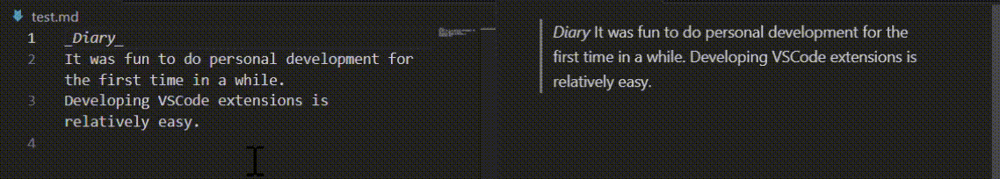

# space-to-br Extension for Visual Studio Code

This extension automatically converts double spaces to ` ` tags in Markdown files (.md), making line breaks explicit and easier to identify.

## Features

- Converts double spaces to ` ` tags.
- Enhances readability and clarity in Markdown files by explicitly indicating line breaks.

## Usage

1. Install the extension from the Visual Studio Code Marketplace.
2. Open a Markdown file (.md) in Visual Studio Code.
3. As you type, double spaces will automatically be converted to ` ` tags.
